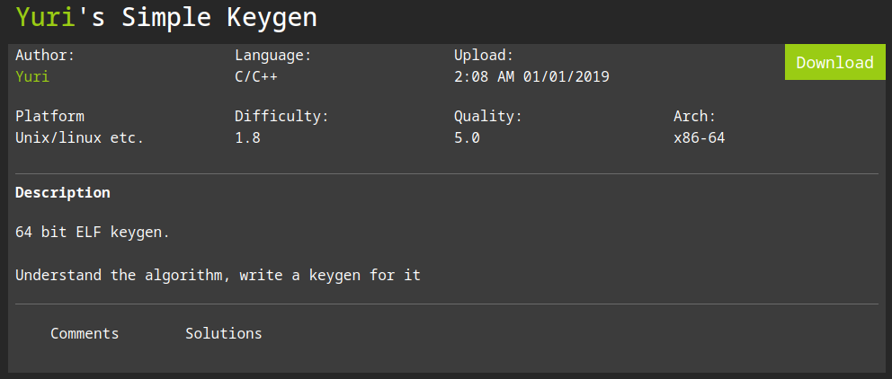
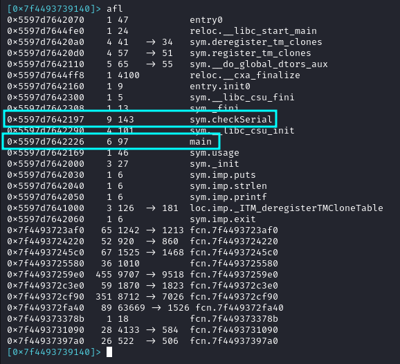
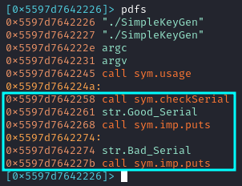
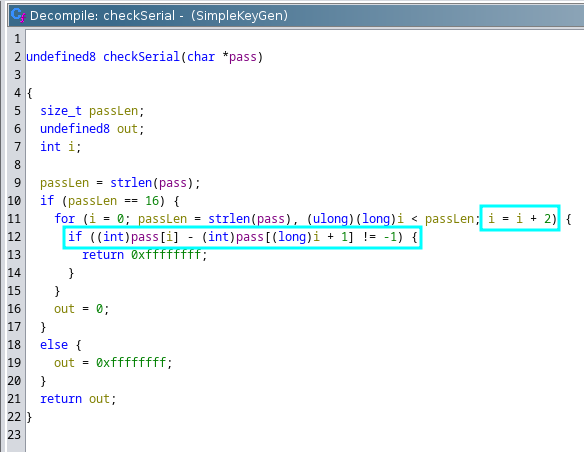

**Autor**: Yuri \\
**Dificultad**: 1.8/6



## Objetivo

En este desafío hay que entender como se comprueba una clave y crear un generador de claves válidas.

## Análisis

Como de costumbre, abro el binario con **radare** y listo las funciones.



Entre ellas hay que destacar **main** y **checkSerial**.

### Main

En la función **main** simplemente se llama a **checkSerial** y dependiendo de lo que devuelva esta función se imprimirá un texto u otro por pantalla.



### checkSerial

Para analizar está función abro el binario en **ghidra** y renombro las variables para que sea más sencillo de entender.



Como se puede ver, para que la clave sea válida lo primero que debe de cumplir es tener una longitud de 16 caracteres.

Una vez que la longitud sea la adecuada, existe un bucle **for** que recorre la clave introducida pero no caracter por catacter si no que lo recorre de 2 en 2.

En el condicional se comprueba que la diferencia entre el caracter en la posición "**i**" y el siguiente (**[i + 1]**) sea -1.  Ej ('a' - 'b' = -1, 'e'-'f' = -1).

## KeyGenerator.py

```py
#!/bin/python3

from pwn import *
import random

abc = "abcdefghijklmnopqrstuvwxyz"

def generateKey():
    key = ""
    for i in range(8):
        num = random.randint(1,len(abc) - 2)
        key += abc[num] + abc[num + 1]
    return key


for i in range(100):
    key = generateKey()
    p = process(["./SimpleKeyGen", key]) 
    print("Serial: " + key + " --> " + str(p.recv()))
```

En este script genero 100 claves aleatorias, todas válidas. Para conseguirlo, tengo una cadena con el abecedario y selecciono 2 caracteres contiguos aleatorios y los añado a la clave. Esto se repite hasta que tenga los 16 caracteres necesarios.

### Ejecución
```
h3rshel@kali:~/Desktop/revs$ python3 keyGenerator.py | grep Serial
Serial: yzbcxyopbcxyyzpq --> b'Good Serial\n'
Serial: lmvwdehilmlmjkij --> b'Good Serial\n'
Serial: tustmnxyghjkopbc --> b'Good Serial\n'
Serial: fgefwxnouvdeijno --> b'Good Serial\n'
Serial: xyrsnoijbchibcpq --> b'Good Serial\n'
Serial: optuqrcdijstwxkl --> b'Good Serial\n'
Serial: lmrsophinomnefrs --> b'Good Serial\n'
[...]
```
