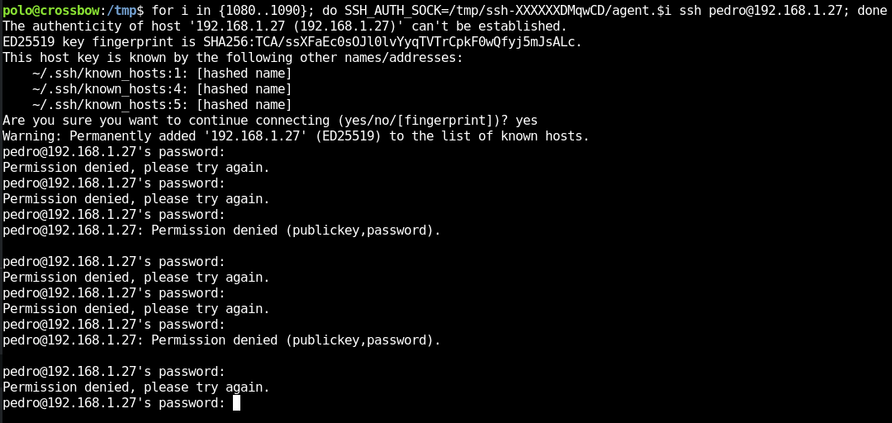

**Autor**: Cromiphi  
**Dificultad**: Medio


## Reconocimiento

Comienzo realizando una enumeración de los puertos abiertos en la máquina.

```bash
$ sudo nmap -p- crossbow.hmv
Starting Nmap 7.94SVN ( https://nmap.org ) at 2023-12-23 11:00 CET
Nmap scan report for crossbow.hmv (192.168.1.27)
Host is up (0.00032s latency).
Not shown: 65532 closed tcp ports (reset)
PORT     STATE SERVICE
22/tcp   open  ssh
80/tcp   open  http
9090/tcp open  zeus-admin
```

No hay que prestar mucha atención a "zeus-admin", eso lo indica **nmap** porque no reconoce el servicio que se está ejecutando. Solo nos interesa que el puerto 9090 está abierto.

### Puerto 80

En el puerto 80 encontramos un servidor http típico. Muestra información sobre **Polo**, sus hobbies y otros datos, pero lo relevante son los archivos JavaScript que podemos encontrar si abrimos el depurador del navegador.


Como se puede ver, hay dos archivos interesantes: **app.js** y **config.js**.

En el archivo **config.js**, encontramos una variable llamada HASH-API-KEY que podemos decodificar en este sitio web: **[Decode snefru](https://md5hashing.net/hash/snefru)**


Guardamos el resultado y continuamos con la enumeración.

### Puerto 9090

Continuando la enumeración en el puerto 9090, nos encontramos con un formulario de inicio de sesión para una máquina Debian.


Pruebo con el usuario **Polo** y la contraseña obtenida del hash, ¡y estamos dentro!

En la parte izquierda, hay acceso a una terminal con la que podemos ejecutar comandos como Polo.

## Escalado de Privilegios

Esta parte es muy interesante, y voy a intentar explicarlo lo mejor posible.

**Nota**
- Si ejecutamos **linpeas.sh** o realizamos una enumeración manual del servidor, nos damos cuenta de que estamos dentro de un contenedor **Docker**. Esto será muy importante más adelante.

### SSH-Agent

Al listar los procesos en ejecución, vemos que el usuario **lea** tiene un "agent" en ejecución con el PID 1087.


### SSH-Agent-Hijacking

Nuestro objetivo será realizar un SSH-Agent-Hijacking. En el siguiente enlace se muestran los conceptos teóricos del ataque: [SSH-Agent-Hijacking](https://n3dx0o.medium.com/understanding-ssh-agent-and-ssh-agent-hijacking-a-real-life-scenario-2522475f7d8e), y en Hacktricks encontramos cómo explotarlo también: [Hacktricks](https://book.hacktricks.xyz/linux-hardening/privilege-escalation/ssh-forward-agent-exploitation)

Si continuamos con la enumeración, vemos que el agente se encuentra en el directorio "/tmp", pero no podemos leerlo.


## Generación SSH-Agent

Si creamos un nuevo agente como el usuario Polo, veremos que el agente generado en la carpeta dentro de /tmp tiene un valor muy similar al PID del proceso que lo ejecuta.


Por lo que, conociendo el PID del agente del usuario **lea**, podemos realizar fuerza bruta y adivinar el nombre de su archivo agente.


Mmmmmm... Esto no ha funcionado.


También podemos ver que existe otro usuario llamado **Pedro**. Ahora intentaré de nuevo con ese usuario y conectándome a la máquina real; recordemos que estamos dentro de un contenedor Docker.

Sustituyo el nombre de la máquina, en lugar de **crossbow**, paso a utilizar la dirección IP (NO LA DEL CONTENEDOR).



Mantengo pulsada la tecla ENTER mientras prueba con los distintos valores hasta encontrar el correcto.


¡Ha conseguido conectarse!

## Root

Enumerando los puertos abiertos, vemos que hay uno solo accesible desde localhost.


Para poder acceder desde mi máquina Kali, realizo una redirección de puertos con **socat**.


### Semaphore

Lo primero que encuentro es un formulario de inicio de sesión.


Esta parte no tiene dificultad, ya que probando credenciales rápidamente descubrimos que tanto el usuario como la contraseña son "admin".

Para conseguir acceso como usuario root, lo primero que hago es crear el siguiente "playbook" en el directorio /tmp.


A continuación, hay que seguir los siguientes pasos:

1. Añado un nuevo repositorio a Semaphore: /tmp


2. Creo un nuevo template, cuyo playbook sea el fichero shell.yml creado anteriormente.


3. Al ejecutarlo va a dar un error sobre "locales".


4. Para corregirlo, edito "dummy variable" añadiendo configuración de idioma.


5. Ahora ya todo funciona.


6. ¡Root!


Muchas gracias a **Cromiphi** por esta máquina.